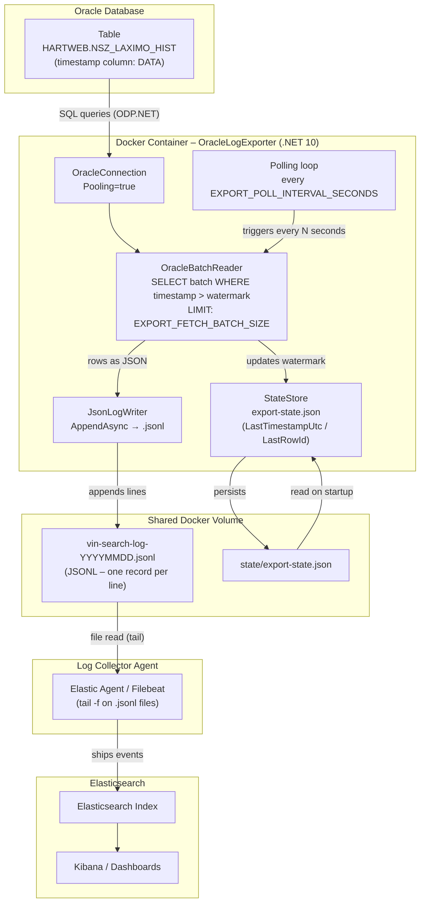

# Solution Architecture

```mermaid
flowchart TD
    subgraph Oracle["Oracle Database"]
        TABLE["Table\nHARTWEB.NSZ_LAXIMO_HIST\n(timestamp column: DATA)"]
    end

    subgraph Container["Docker Container – OracleLogExporter (.NET 10)"]
        CONN["OracleConnection\nPooling=true"]
        BATCH["OracleBatchReader\nSELECT batch WHERE timestamp > watermark\nLIMIT: EXPORT_FETCH_BATCH_SIZE"]
        STATE["StateStore\nexport-state.json\n(LastTimestampUtc / LastRowId)"]
        WRITER["JsonLogWriter\nAppendAsync → .jsonl"]
        LOOP["Polling loop\nevery EXPORT_POLL_INTERVAL_SECONDS"]
    end

    subgraph Volume["Shared Docker Volume"]
        JSONL["vin-search-log-YYYYMMDD.jsonl\n(JSONL – one record per line)"]
        STATEFILE["state/export-state.json"]
    end

    subgraph Collector["Log Collector Agent"]
        FILEBEAT["Elastic Agent / Filebeat\n(tail -f on .jsonl files)"]
    end

    subgraph Elastic["Elasticsearch"]
        INDEX["Elasticsearch Index"]
        KIBANA["Kibana / Dashboards"]
    end

    TABLE -- "SQL queries (ODP.NET)" --> CONN
    CONN --> BATCH
    BATCH -- "rows as JSON" --> WRITER
    WRITER -- "appends lines" --> JSONL
    BATCH -- "updates watermark" --> STATE
    STATE -- "persists" --> STATEFILE
    STATEFILE -- "read on startup" --> STATE
    LOOP -- "triggers every N seconds" --> BATCH

    JSONL -- "file read (tail)" --> FILEBEAT
    FILEBEAT -- "ships events" --> INDEX
    INDEX --> KIBANA
```
